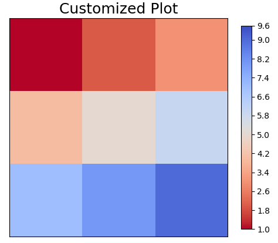
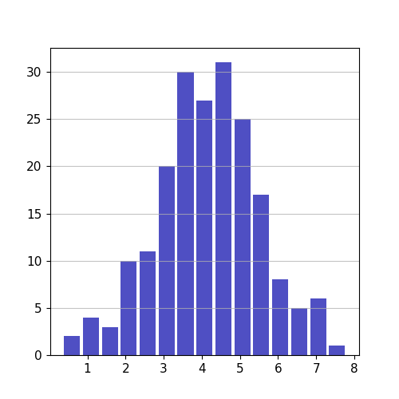
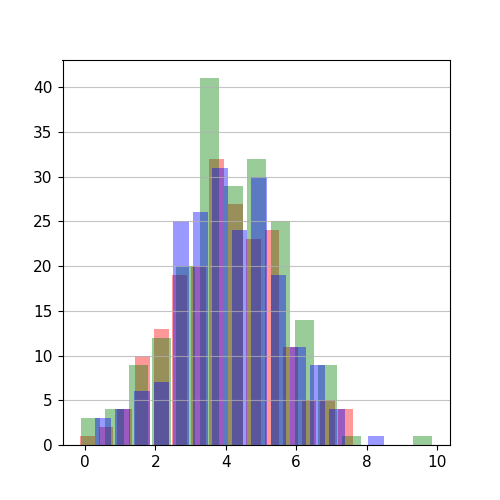

# Cleopatra

[](https://badge.fury.io/py/cleopatra)
[](https://pypi.org/project/cleopatra)
[](https://anaconda.org/conda-forge/cleopatra)
[](https://www.gnu.org/licenses/gpl-3.0)
[](https://codecov.io/github/serapeum-org/cleopatra)

[](https://serapeum-org.github.io/cleopatra/latest/)
[](https://github.com/pre-commit/pre-commit)


**Cleopatra** is a matplotlib utility package for visualizing 2D/3D numpy arrays, unstructured meshes, and statistical
histograms. It targets scientific and research users working with geospatial and raster data, providing a high-level API
over matplotlib with sensible defaults and rich customization.

## Main Features

### ArrayGlyph -- Raster / Array Visualization
- Plot 2D numpy arrays with automatic colorbar and customizable color scales (linear, power, symmetric log-norm,
  boundary-norm, midpoint).
- Display cell values and overlay point markers on the plot.
- Animate 3D arrays over time and export to GIF, MP4, MOV, or AVI (via ffmpeg).

<p align="center">
  
  
</p>

### MeshGlyph -- Unstructured Mesh Visualization
- Visualize UGRID-style unstructured mesh data using triangulation (`tripcolor`, `tricontourf`).
- Render wireframe outlines via `LineCollection`.
- Accepts raw numpy arrays of node coordinates and face-node connectivity.
- Animate time-varying mesh data.

### StatisticalGlyph -- Histogram Plots
- Create histograms for 1D and 2D datasets with customizable bins, colors, and transparency.

<p align="center">
  
  
</p>

### Colors -- Color Utilities
- Convert between hex, RGB (0-255), and normalized RGB (0-1) formats.
- Extract color ramps from images and create custom matplotlib colormaps.

## Installation

### pip

```bash
pip install cleopatra
```

### conda

```bash
conda install -c conda-forge cleopatra
```

### From source (latest development version)

```bash
pip install git+https://github.com/serapeum-org/cleopatra
```

## Quick Start

### Plot a 2D array

```python
import numpy as np
from cleopatra.array_glyph import ArrayGlyph

arr = np.random.rand(10, 10)
glyph = ArrayGlyph(arr)
fig, ax = glyph.plot(title="Random Array")
```

### Create a histogram

```python
import numpy as np
from cleopatra.statistical_glyph import StatisticalGlyph

data = np.random.normal(0, 1, 1000)
stat = StatisticalGlyph(data)
fig, ax = stat.histogram(bins=30)
```

### Plot an unstructured mesh

```python
import numpy as np
from cleopatra.mesh_glyph import MeshGlyph

node_x = np.array([0.0, 1.0, 0.5, 1.5])
node_y = np.array([0.0, 0.0, 1.0, 1.0])
face_nodes = np.array([[0, 1, 2], [1, 3, 2]])
face_data = np.array([10.0, 20.0])

mg = MeshGlyph(node_x, node_y, face_nodes)
fig, ax = mg.plot(face_data, location="face", title="Mesh Data")
```

## Requirements

- Python >= 3.11
- numpy >= 2.0.0
- matplotlib >= 3.8.4

## Documentation

Full documentation is available at [serapeum-org.github.io/cleopatra](https://serapeum-org.github.io/cleopatra/latest/).

## License

Cleopatra is licensed under the [GNU General Public License v3](https://www.gnu.org/licenses/gpl-3.0).
