# Cleopatra

[](https://badge.fury.io/py/cleopatra)
[](https://pypi.org/project/cleopatra)
[](https://anaconda.org/conda-forge/cleopatra)
[](https://www.gnu.org/licenses/gpl-3.0)
[](https://codecov.io/github/serapeum-org/cleopatra)

[](https://serapeum-org.github.io/cleopatra/latest/)
[](https://github.com/pre-commit/pre-commit)


**Cleopatra** is a matplotlib utility package for visualizing 2D/3D numpy arrays, unstructured meshes, point clouds,
vector fields, polygons, lines, and statistical distributions. It targets scientific and research users working with
geospatial and raster data, providing a high-level API over matplotlib with sensible defaults and rich customization.

For the package's boundaries — what belongs here and what does not — see [`SCOPE.md`](SCOPE.md).

## Package Layout

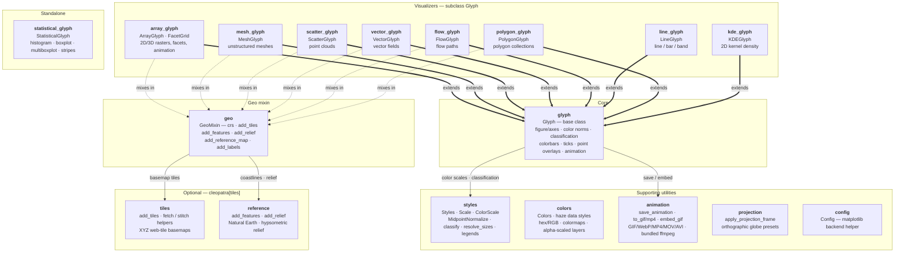

- `glyph` provides the shared `Glyph` base class (figure/axes lifecycle, colorbars, color norms, ticks, classification,
  animation).
- The user-facing visualizers all subclass `Glyph` and share its colour-mapping/colorbar pipeline — `array_glyph`
  (`ArrayGlyph`, `FacetGrid`), `mesh_glyph` (`MeshGlyph`), `scatter_glyph` (`ScatterGlyph`), `vector_glyph`
  (`VectorGlyph`), `flow_glyph` (`FlowGlyph`), `line_glyph` (`LineGlyph`), `polygon_glyph` (`PolygonGlyph`), and
  `kde_glyph` (`KDEGlyph`). `statistical_glyph` (`StatisticalGlyph`) stands alone.
- `geo` provides `GeoMixin`, mixed into the six geographic visualizers — `array_glyph`, `mesh_glyph`, `scatter_glyph`,
  `vector_glyph`, `flow_glyph`, and `polygon_glyph` (not `line_glyph`, `kde_glyph`, or `statistical_glyph`) — adding a
  settable `crs` plus one-call basemap helpers on the glyph's own axes: `add_tiles`, `add_features`, `add_relief`,
  `add_reference_map`, and `add_labels`.
- `tiles` and `reference` are the optional (`cleopatra[tiles]`) basemap data sources `geo` wraps — `tiles`
  fetches/stitches XYZ web-tile mosaics, `reference` draws fixed public Natural Earth vector layers and a hypsometric
  relief raster.
- `colors`, `styles`, `animation`, `projection`, and `config` are supporting utilities (colour conversions plus
  composable "haze"-style data layers via `apply_data_style` and alpha-scaled image/mesh rendering; predefined
  styles, `MidpointNormalize`, `ColorScale`, value→size mapping, `classify` classification schemes and legend
  builders; glyph-independent animation save/embed helpers spanning GIF/WebP/MP4/MOV/AVI with a bundled-ffmpeg
  fallback; static projected map frames plus orthographic globe reprojection presets; and the matplotlib-backend
  helper).

## Main Features

### ArrayGlyph -- Raster / Array Visualization
- Plot 2D numpy arrays with automatic colorbar and customizable color scales (linear, power, symmetric log-norm,
  boundary-norm, midpoint).
- Display cell values and overlay point markers on the plot.
- Animate 3D single-band stacks or 4D RGB/RGBA true-colour stacks over time, and export to GIF, WebP, MP4, MOV, or
  AVI (bundled ffmpeg -- no separate install needed).
- Drop in an ECMWF/CAMS-style basemap (coastlines, borders, graticule) with a single `add_reference_map` call.

<p align="center">
  
  
</p>

### MeshGlyph -- Unstructured Mesh Visualization
- Visualize UGRID-style unstructured mesh data using triangulation (`tripcolor`, `tricontourf`).
- Render wireframe outlines via `LineCollection`.
- Accepts raw numpy arrays of node coordinates and face-node connectivity.
- Animate time-varying mesh data.

<p align="center">
  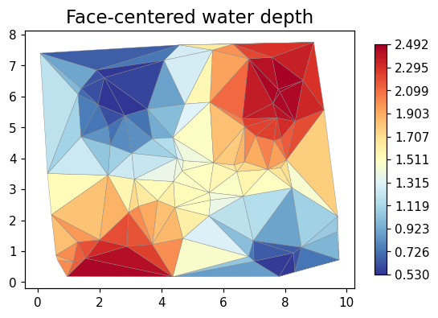
  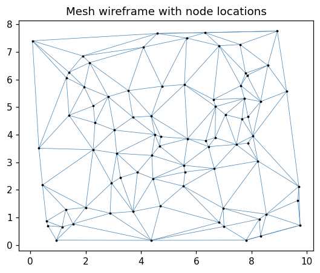
</p>

### StatisticalGlyph -- Distribution Plots
- Create histograms for 1D and 2D datasets with customizable bins, colors, and transparency.
- Draw boxplots, multi-boxplots, and strip plots.

<p align="center">
  
  
</p>

### ScatterGlyph -- Point Clouds
- Plot 2D point clouds, colour-mapped by a per-point `values` array with a matching colorbar.
- Encode a second quantity through per-point marker `sizes` (with an optional size legend), so colour and size carry
  two variables at once.

<p align="center">
  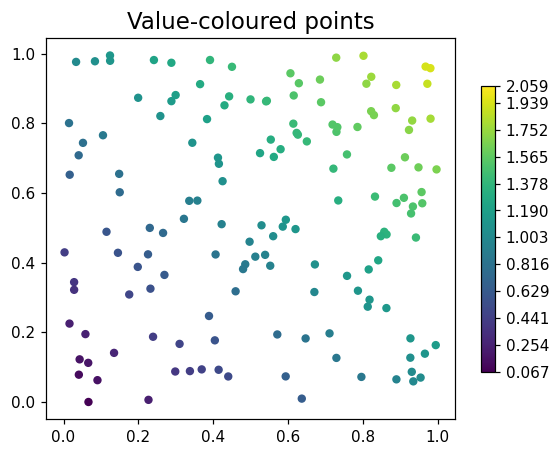
  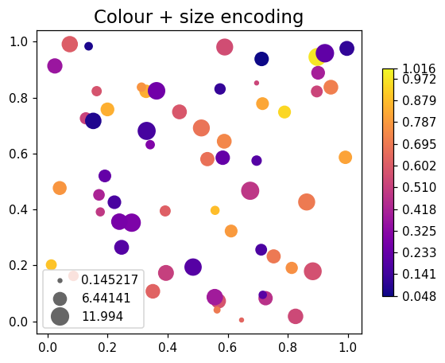
</p>

### VectorGlyph -- Vector Fields
- Render 2D `(u, v)` vector fields as arrows (`quiver`), wind barbs, or streamlines.
- Colour the artist by vector magnitude `hypot(u, v)` through the shared scalar-mapping pipeline.

<p align="center">
  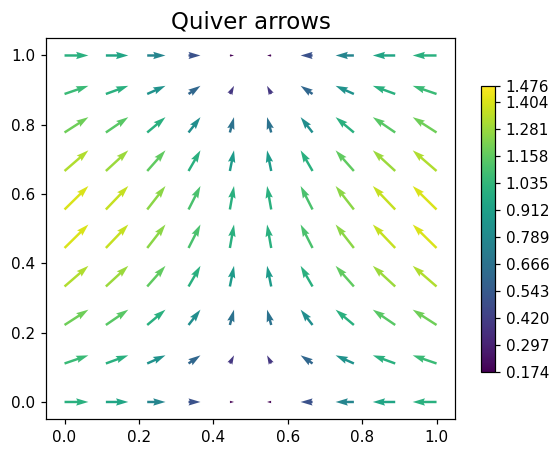
  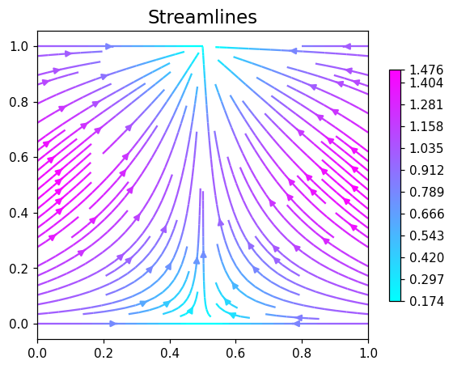
</p>

### FlowGlyph -- Flow Paths
- Draw a sequence of polylines as a `LineCollection`, colour-mapped by a per-path `values` array.
- Scale per-path line widths by magnitude, with an optional width legend.

<p align="center">
  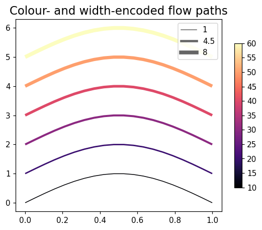
</p>

### LineGlyph -- Line / Bar / Band Plots
- Line, bar, and `fill_between` (band) plots. `line` accepts 1D or 2D `y` (one series per column); `bar` takes a
  single 1D series.

<p align="center">
  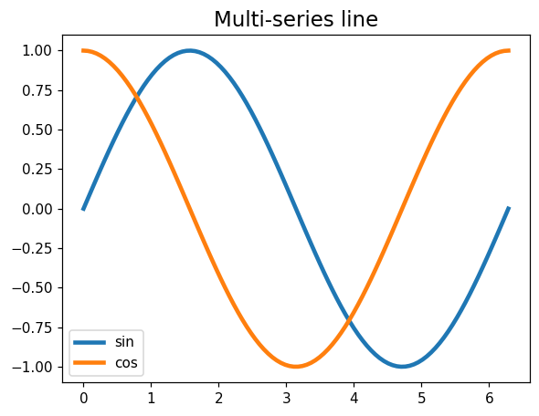
  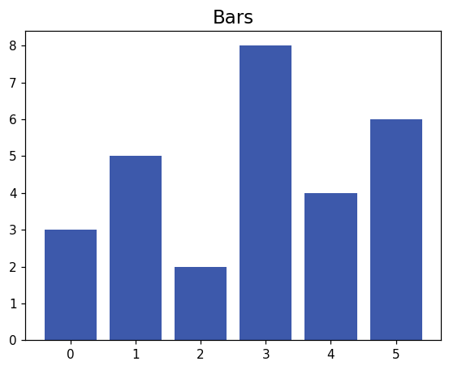
</p>

### PolygonGlyph -- Polygon Collections
- Fill and colour-map collections of polygons by a per-polygon `values` array, or draw outlines only.

<p align="center">
  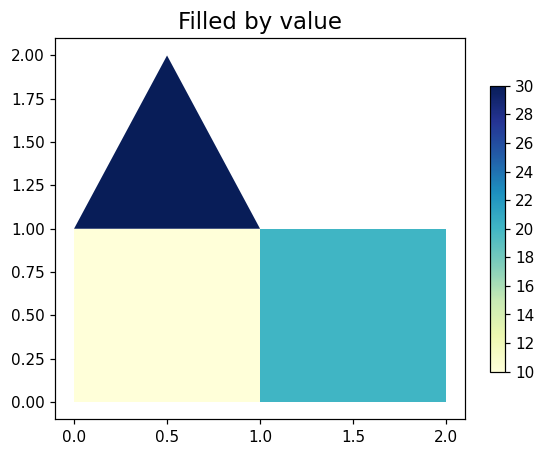
  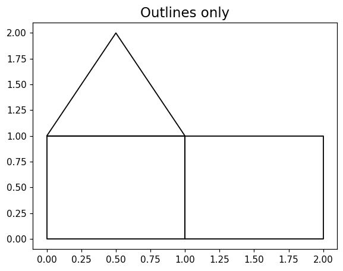
</p>

### KDEGlyph -- Kernel Density
- Estimate a 2D Gaussian kernel density of an `(x, y)` point cloud (NumPy only, no scipy) and draw it as filled or line
  density contours.

<p align="center">
  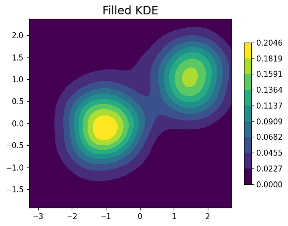
  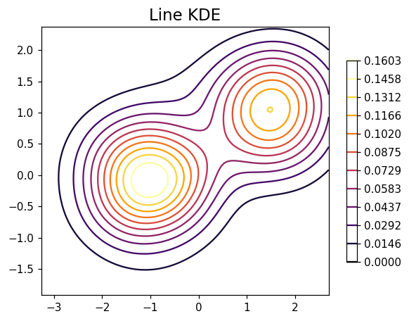
</p>

### Geospatial basemaps -- GeoMixin
- `ArrayGlyph`, `MeshGlyph`, `ScatterGlyph`, `VectorGlyph`, `FlowGlyph`, and `PolygonGlyph` mix in `GeoMixin`, adding a
  settable `crs` plus one-call basemap helpers on `glyph.ax`: `add_tiles` (XYZ web-tile mosaics), `add_features` /
  `add_relief` (Natural Earth coastlines, borders, land, ocean, rivers, lakes, and a hypsometric relief backdrop), a
  one-call `add_reference_map` preset (`"ecmwf"`, `"ecmwf-dark"`, or `"auto"`), and `add_labels` for city/point labels.
- `tiles` and the fixed-public-dataset `reference` layers require the `cleopatra[tiles]` extra.

<p align="center">
  
  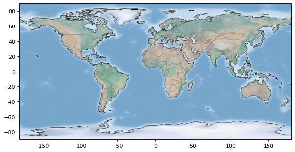
</p>

### Composable data styles & globe projections
- `colors.apply_data_style` renders one or more layers with a named preset (currently `"haze"`, an aerosol /
  organic-matter / dust look) -- per-pixel opacity tied to value via `alpha_scaled_image` / `alpha_scaled_mesh`, plus a
  swatch legend, in one call.
- `projection.apply_projection_style` reprojects `(lon, lat, data)` onto an orthographic "globe" view (or leaves it
  flat) via named presets, pairing with `apply_data_style` to build ECMWF/CAMS-style globe animations in a few lines.
  The orthographic helpers require the `cleopatra[tiles]` extra (`pyproj`).

### Colors -- Color Utilities
- Convert between hex, RGB (0-255), and normalized RGB (0-1) formats.
- Extract color ramps from images and create custom matplotlib colormaps.
- Ready-made "haze" colormaps and alpha-scaled rendering helpers for the composable data styles above.

## Installation

### pip

```bash
pip install cleopatra

# with the optional web-tile basemap support (cleopatra.tiles.add_tiles)
pip install "cleopatra[tiles]"
```

### conda

```bash
conda install -c conda-forge cleopatra

# with the optional web-tile basemap support
conda install -c conda-forge cleopatra-tiles
```

The conda packages are built from the
[cleopatra-feedstock](https://github.com/conda-forge/cleopatra-feedstock)
(the `cleopatra-tiles` output bundles `mercantile`, `pillow`, `pyproj`, and
`xyzservices`).

### From source (latest development version)

```bash
pip install git+https://github.com/serapeum-org/cleopatra
```

## Quick Start

### Plot a 2D array

```python
import numpy as np
from cleopatra.array_glyph import ArrayGlyph

arr = np.random.rand(10, 10)
glyph = ArrayGlyph(arr)
fig, ax = glyph.plot(title="Random Array")
```

### Create a histogram

```python
import numpy as np
from cleopatra.statistical_glyph import StatisticalGlyph

data = np.random.normal(0, 1, 1000)
stat = StatisticalGlyph(data)
fig, ax = stat.histogram(bins=30)
```

### Plot an unstructured mesh

```python
import numpy as np
from cleopatra.mesh_glyph import MeshGlyph

node_x = np.array([0.0, 1.0, 0.5, 1.5])
node_y = np.array([0.0, 0.0, 1.0, 1.0])
face_nodes = np.array([[0, 1, 2], [1, 3, 2]])
face_data = np.array([10.0, 20.0])

mg = MeshGlyph(node_x, node_y, face_nodes)
fig, ax = mg.plot(face_data, location="face", title="Mesh Data")
```

### Plot a value-coloured point cloud

```python
import numpy as np
from cleopatra.scatter_glyph import ScatterGlyph

x = np.random.rand(100)
y = np.random.rand(100)
values = np.random.rand(100)
sg = ScatterGlyph(x, y, values=values)
fig, ax, sc = sg.plot(title="Scatter")
```

### Plot a vector field

```python
import numpy as np
from cleopatra.vector_glyph import VectorGlyph

x, y = np.meshgrid(np.linspace(0, 1, 8), np.linspace(0, 1, 8))
u, v = np.cos(x), np.sin(y)
vg = VectorGlyph(x, y, u, v)
fig, ax, artist = vg.plot(kind="quiver", title="Vector Field")
```

### Add a basemap to an array plot

```python
import numpy as np
from cleopatra.array_glyph import ArrayGlyph

field = np.random.rand(80, 120)
glyph = ArrayGlyph(field, extent=[-100, 15, -40, 55])  # west, south, east, north
glyph.plot(cmap="turbo", cbar_label="anomaly")
glyph.add_reference_map("ecmwf")  # coastlines, borders, and a lon/lat graticule
```

## Requirements

- Python >= 3.11
- numpy >= 2.0.0
- matplotlib >= 3.9

Ships with a bundled ffmpeg binary (via `imageio-ffmpeg`), so `save_animation` can export MP4/MOV/AVI without a
separate system install. Geospatial basemaps and globe-projection presets (`GeoMixin`, `cleopatra.tiles`,
`cleopatra.reference`, and the orthographic helpers in `cleopatra.projection`) need the `cleopatra[tiles]` extra.

## Documentation

Full documentation is available at [serapeum-org.github.io/cleopatra](https://serapeum-org.github.io/cleopatra/latest/).

## License

Cleopatra is licensed under the [GNU General Public License v3](https://www.gnu.org/licenses/gpl-3.0).
