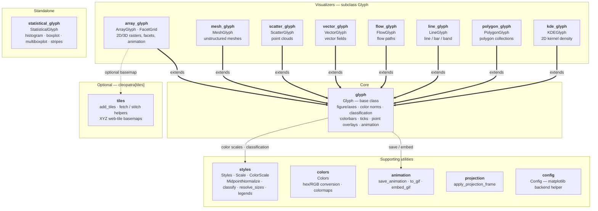

# Cleopatra

[](https://badge.fury.io/py/cleopatra)
[](https://pypi.org/project/cleopatra)
[](https://anaconda.org/conda-forge/cleopatra)
[](https://www.gnu.org/licenses/gpl-3.0)
[](https://codecov.io/github/serapeum-org/cleopatra)

[](https://serapeum-org.github.io/cleopatra/latest/)
[](https://github.com/pre-commit/pre-commit)


**Cleopatra** is a matplotlib utility package for visualizing 2D/3D numpy arrays, unstructured meshes, point clouds,
vector fields, polygons, lines, and statistical distributions. It targets scientific and research users working with
geospatial and raster data, providing a high-level API over matplotlib with sensible defaults and rich customization.

For the package's boundaries — what belongs here and what does not — see [`SCOPE.md`](SCOPE.md).

## Package Layout



- `glyph` provides the shared `Glyph` base class (figure/axes lifecycle, colorbars, color norms, ticks, classification,
  animation).
- The user-facing visualizers all subclass `Glyph` and share its colour-mapping/colorbar pipeline — `array_glyph`
  (`ArrayGlyph`, `FacetGrid`), `mesh_glyph` (`MeshGlyph`), `scatter_glyph` (`ScatterGlyph`), `vector_glyph`
  (`VectorGlyph`), `flow_glyph` (`FlowGlyph`), `line_glyph` (`LineGlyph`), `polygon_glyph` (`PolygonGlyph`), and
  `kde_glyph` (`KDEGlyph`). `statistical_glyph` (`StatisticalGlyph`) stands alone.
- `tiles` adds the optional web-tile basemap helper (`cleopatra.tiles.add_tiles`), behind the `cleopatra[tiles]` extra.
- `colors`, `styles`, `animation`, `projection`, and `config` are supporting utilities (colour conversions; predefined
  styles, `MidpointNormalize`, `ColorScale`, value→size mapping, `classify` classification schemes and legend builders;
  glyph-independent animation save/embed helpers; static projected map frames; and the matplotlib-backend helper).

## Main Features

### ArrayGlyph -- Raster / Array Visualization
- Plot 2D numpy arrays with automatic colorbar and customizable color scales (linear, power, symmetric log-norm,
  boundary-norm, midpoint).
- Display cell values and overlay point markers on the plot.
- Animate 3D arrays over time and export to GIF, MP4, MOV, or AVI (via ffmpeg).

<p align="center">
  
  
</p>

### MeshGlyph -- Unstructured Mesh Visualization
- Visualize UGRID-style unstructured mesh data using triangulation (`tripcolor`, `tricontourf`).
- Render wireframe outlines via `LineCollection`.
- Accepts raw numpy arrays of node coordinates and face-node connectivity.
- Animate time-varying mesh data.

### StatisticalGlyph -- Distribution Plots
- Create histograms for 1D and 2D datasets with customizable bins, colors, and transparency.
- Draw boxplots, multi-boxplots, and strip plots.

<p align="center">
  
  
</p>

### ScatterGlyph -- Point Clouds
- Plot 2D point clouds, colour-mapped by a per-point `values` array with a matching colorbar.
- Encode a second quantity through per-point marker `sizes` (with an optional size legend), so colour and size carry
  two variables at once.

### VectorGlyph -- Vector Fields
- Render 2D `(u, v)` vector fields as arrows (`quiver`), wind barbs, or streamlines.
- Colour the artist by vector magnitude `hypot(u, v)` through the shared scalar-mapping pipeline.

### FlowGlyph -- Flow Paths
- Draw a sequence of polylines as a `LineCollection`, colour-mapped by a per-path `values` array.
- Scale per-path line widths by magnitude, with an optional width legend.

### LineGlyph -- Line / Bar / Band Plots
- Line, bar, and `fill_between` (band) plots from 1D or 2D `y` (one series per column).

### PolygonGlyph -- Polygon Collections
- Fill and colour-map collections of polygons by a per-polygon `values` array, or draw outlines only.

### KDEGlyph -- Kernel Density
- Estimate a 2D Gaussian kernel density of an `(x, y)` point cloud (NumPy only, no scipy) and draw it as filled or line
  density contours.

### Colors -- Color Utilities
- Convert between hex, RGB (0-255), and normalized RGB (0-1) formats.
- Extract color ramps from images and create custom matplotlib colormaps.

## Installation

### pip

```bash
pip install cleopatra

# with the optional web-tile basemap support (cleopatra.tiles.add_tiles)
pip install "cleopatra[tiles]"
```

### conda

```bash
conda install -c conda-forge cleopatra

# with the optional web-tile basemap support
conda install -c conda-forge cleopatra-tiles
```

The conda packages are built from the
[cleopatra-feedstock](https://github.com/conda-forge/cleopatra-feedstock)
(the `cleopatra-tiles` output bundles `mercantile`, `pillow`, `pyproj`, and
`xyzservices`).

### From source (latest development version)

```bash
pip install git+https://github.com/serapeum-org/cleopatra
```

## Quick Start

### Plot a 2D array

```python
import numpy as np
from cleopatra.array_glyph import ArrayGlyph

arr = np.random.rand(10, 10)
glyph = ArrayGlyph(arr)
fig, ax = glyph.plot(title="Random Array")
```

### Create a histogram

```python
import numpy as np
from cleopatra.statistical_glyph import StatisticalGlyph

data = np.random.normal(0, 1, 1000)
stat = StatisticalGlyph(data)
fig, ax = stat.histogram(bins=30)
```

### Plot an unstructured mesh

```python
import numpy as np
from cleopatra.mesh_glyph import MeshGlyph

node_x = np.array([0.0, 1.0, 0.5, 1.5])
node_y = np.array([0.0, 0.0, 1.0, 1.0])
face_nodes = np.array([[0, 1, 2], [1, 3, 2]])
face_data = np.array([10.0, 20.0])

mg = MeshGlyph(node_x, node_y, face_nodes)
fig, ax = mg.plot(face_data, location="face", title="Mesh Data")
```

### Plot a value-coloured point cloud

```python
import numpy as np
from cleopatra.scatter_glyph import ScatterGlyph

x = np.random.rand(100)
y = np.random.rand(100)
values = np.random.rand(100)
sg = ScatterGlyph(x, y, values=values)
fig, ax, sc = sg.plot(title="Scatter")
```

### Plot a vector field

```python
import numpy as np
from cleopatra.vector_glyph import VectorGlyph

x, y = np.meshgrid(np.linspace(0, 1, 8), np.linspace(0, 1, 8))
u, v = np.cos(x), np.sin(y)
vg = VectorGlyph(x, y, u, v)
fig, ax, artist = vg.plot(kind="quiver", title="Vector Field")
```

## Requirements

- Python >= 3.11
- numpy >= 2.0.0
- matplotlib >= 3.9

## Documentation

Full documentation is available at [serapeum-org.github.io/cleopatra](https://serapeum-org.github.io/cleopatra/latest/).

## License

Cleopatra is licensed under the [GNU General Public License v3](https://www.gnu.org/licenses/gpl-3.0).
