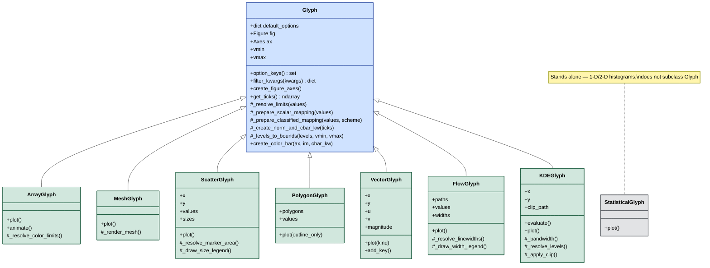
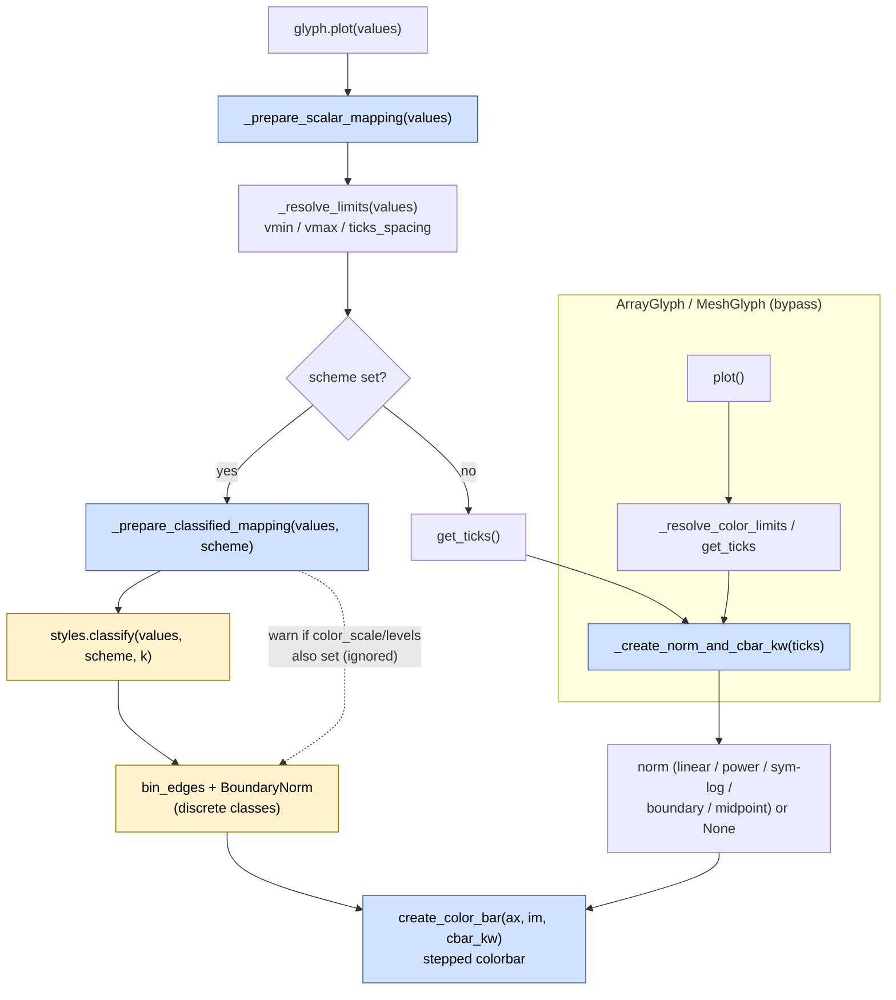
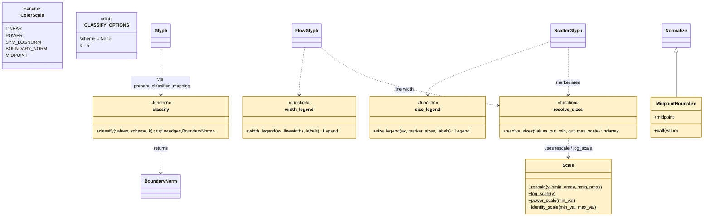
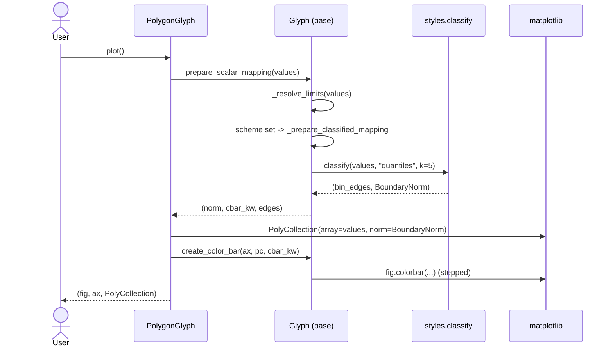
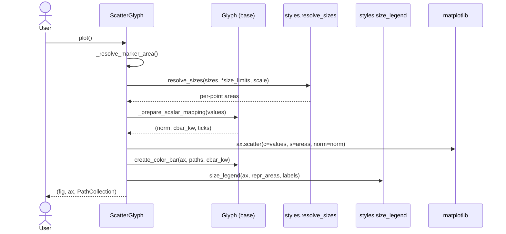

# Cleopatra glyph architecture

Architecture and class diagrams for cleopatra's glyph subsystem and the shared
colour / scale pipeline, including the geoplot-upstream additions
(classification `scheme`, value→size scaling, `FlowGlyph`, `KDEGlyph`).

All diagrams use [Mermaid](https://mermaid.js.org/) (rendered by
`mkdocs-mermaid2` in the docs site and by GitHub).

## Legend

| Style | Meaning |
|-------|---------|
| **base** (blue) | `Glyph` base class — shared figure/axes, colour, colorbar, ticks |
| **glyph** (green) | concrete user-facing glyph subclasses |
| **standalone** (grey) | classes that do **not** subclass `Glyph` |
| **helper** (amber) | `styles` functions / classes (no glyph instance needed) |

---

## 1. Class hierarchy

`ArrayGlyph`, `MeshGlyph`, `ScatterGlyph`, `PolygonGlyph`, `VectorGlyph`,
`FlowGlyph`, and `KDEGlyph` subclass `Glyph`. `StatisticalGlyph` is independent.

---

## 2. Shared colour / scale pipeline

Every colour-by-value glyph that routes through `_prepare_scalar_mapping`
(`ScatterGlyph`, `PolygonGlyph`, `VectorGlyph`, `FlowGlyph`) shares one
contract. Since the geoplot-upstream work, a `scheme` option short-circuits to
classified (discrete) colouring; otherwise the continuous `color_scale` /
`levels` path runs. `ArrayGlyph` / `MeshGlyph` build their norm directly via
`_create_norm_and_cbar_kw` and therefore do **not** accept `scheme`.

---

## 3. `styles` helpers

Stateless helpers used by the glyphs (and usable standalone). `scheme`/`k`
live in `CLASSIFY_OPTIONS`, mixed only into the glyphs whose colouring is
driven purely by the norm.

---

## 4. Sequence — classified choropleth (`scheme`)

A `PolygonGlyph(..., scheme="quantiles", k=5).plot()` call, end to end.

---

## 5. Sequence — value→size scatter

A `ScatterGlyph(x, y, values=v, sizes=w, size_legend=True).plot()` call: colour
and size are resolved independently.

---

## Notes / design patterns

- **Template method** — `Glyph` owns the colour/colorbar/ticks contract; each
  subclass implements only its `plot()` rendering and reuses
  `_prepare_scalar_mapping` + `create_color_bar`.
- **Strategy** — `color_scale` (`ColorScale`) and `scheme` select the
  normalization strategy; `size_scale` / `width_scale` select the value→size
  transform inside `resolve_sizes`.
- **Shared-but-scoped options** — `scheme`/`k` are *not* in the shared
  `DEFAULT_OPTIONS`; they live in `CLASSIFY_OPTIONS` and are mixed only into the
  glyphs whose renderer is driven purely by the norm, so `ArrayGlyph` /
  `MeshGlyph` / `KDEGlyph` reject `scheme` instead of silently ignoring it.
- **No new dependency at all** — classification (including the Fisher-Jenks
  natural-breaks optimisation), KDE, and rescaling are pure numpy + matplotlib.
