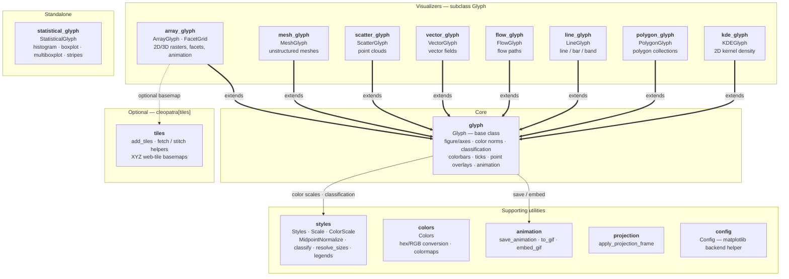

# Cleopatra - Matplotlib utility package

**cleopatra** is a Python package providing a fast and flexible way to visualize data using matplotlib.
It provides a high-level API over matplotlib for 2-D/3-D `numpy` arrays, unstructured meshes, point clouds,
vector fields, polygons, lines, and statistical distributions — plotting, animating, and displaying data with
sensible scientific defaults.

For the package's boundaries — what belongs here and what does not — see the [Scope](scope.md) page.

## Package Layout

- `glyph` provides the shared `Glyph` base class (figure/axes lifecycle, colorbars, color norms, ticks,
  classification, animation).
- The user-facing visualizers all subclass `Glyph` and share its colour-mapping / colorbar pipeline —
  `array_glyph` (`ArrayGlyph`, `FacetGrid`), `mesh_glyph` (`MeshGlyph`), `scatter_glyph` (`ScatterGlyph`),
  `vector_glyph` (`VectorGlyph`), `flow_glyph` (`FlowGlyph`), `line_glyph` (`LineGlyph`), `polygon_glyph`
  (`PolygonGlyph`), and `kde_glyph` (`KDEGlyph`). `statistical_glyph` (`StatisticalGlyph`) stands alone.
- `tiles` adds the optional web-tile basemap helper (`cleopatra.tiles.add_tiles`), behind the `cleopatra[tiles]` extra.
- `colors`, `styles`, `animation`, `projection`, and `config` are supporting utilities (colour conversions; predefined
  styles, `MidpointNormalize`, `ColorScale`, value→size mapping, `classify` classification schemes and legend builders;
  glyph-independent animation save/embed helpers; static projected map frames; and the matplotlib-backend helper).

## Main Features

### `ArrayGlyph` — raster / array visualization

- Plot 2-D and 3-D `numpy` arrays with automatic colorbars and selectable colour scales
  (`linear`, `power`, `sym-lognorm`, `boundary-norm`, `midpoint`), rendered via `imshow`,
  `pcolormesh`, `contour`, or `contourf` (`plot(kind=...)`).
- xarray-aligned colour options: `robust`, `center`, `levels`, `extend`, `cbar_kwargs`.
- Curvilinear / non-uniform grids with `coords=(x, y)`; faceted grids of subplots with
  `facet(col=, row=, col_wrap=, extents=)` → `FacetGrid`.
- Animate 3-D arrays over time (with an optional lazy `data_getter` for streaming frames)
  and export to GIF / MP4 / MOV / AVI (via ffmpeg).
- Overlay point markers and per-cell value labels.

See the [ArrayGlyph reference](reference/array-glyph.md).

### `MeshGlyph` — unstructured mesh visualization

- Visualise UGRID-style unstructured meshes with `tripcolor` / `tricontourf` and
  wireframe outlines; animate time-varying mesh data.

See the [MeshGlyph reference](reference/mesh-glyph.md).

### `StatisticalGlyph` — distribution plots

- 1-D and 2-D histograms with customizable bins, colours, and transparency.
- Boxplots, grouped multi-boxplots, and warming-stripe bands.

See the [Statistical plots reference](reference/statistics-glyph.md).

### `ScatterGlyph` — point clouds

- 2-D point clouds colour-mapped by a per-point `values` array, with an independent per-point
  `sizes` encoding (and optional size legend) so colour and size carry two variables at once.

See the [ScatterGlyph reference](reference/scatter-glyph.md).

### `VectorGlyph` — vector fields

- 2-D `(u, v)` fields as arrows (`quiver`), wind barbs, or streamlines, coloured by magnitude.

See the [VectorGlyph reference](reference/vector-glyph.md).

### `FlowGlyph` — flow paths

- A sequence of polylines as a `LineCollection`, colour-mapped by value and width-scaled by magnitude.

See the [FlowGlyph reference](reference/flow-glyph.md).

### `LineGlyph` — line / bar / band plots

- Line, bar, and `fill_between` (band) plots from 1-D or 2-D `y` (one series per column).

See the [LineGlyph reference](reference/line-glyph.md).

### `PolygonGlyph` — polygon collections

- Value-coloured or outline-only collections of polygons (`PolyCollection`).

See the [PolygonGlyph reference](reference/polygon-glyph.md).

### `KDEGlyph` — kernel density

- 2-D Gaussian kernel-density contours (filled or line), NumPy only — no scipy.

See the [KDEGlyph reference](reference/kde-glyph.md).

### `cleopatra.tiles` — web-tile basemaps (optional)

- `add_tiles(ax, ...)` overlays an XYZ web-tile basemap (OpenStreetMap, CartoDB, Esri, …)
  underneath your data — pure Python, no GDAL. Behind the `cleopatra[tiles]` extra
  (`conda install -c conda-forge cleopatra-tiles`).

See the [Tiles reference](reference/tiles.md).

### `Colors`, `styles`, `config`

- `Colors` — convert between hex / RGB(0–255) / normalized-RGB(0–1) and build colormaps
  from images.
- `styles` — predefined line/marker styles, `ColorScale`, `MidpointNormalize`, value→size
  mapping (`resolve_sizes`), `classify` classification schemes, and reusable legend builders.
- `config` — an opt-in helper for picking the matplotlib backend (importing `cleopatra`
  does not change it).

See the [Styles reference](reference/styles-glyph.md) and [Colors reference](reference/colors-glyph.md).
