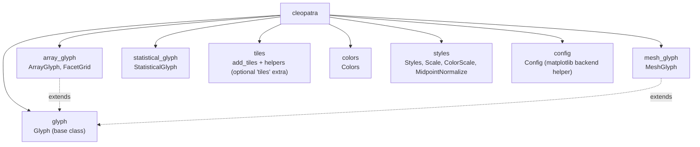

# Cleopatra - Matplotlib utility package

**cleopatra** is a Python package providing a fast and flexible way to build visualize data using matplotlib.
It provides functionalities to handle 3D arrays and perform various operations on them, such as plotting, animating,
and displaying the array. It also provides functionalities for creating statistical plots.

## Package Layout

- `glyph` provides the shared `Glyph` base class (figure/axes lifecycle, colorbars, color norms, ticks, animation).
- `array_glyph` (`ArrayGlyph`, `FacetGrid`), `mesh_glyph` (`MeshGlyph`), and `statistical_glyph` (`StatisticalGlyph`)
  are the user-facing visualizers; `ArrayGlyph` and `MeshGlyph` subclass `Glyph`, `StatisticalGlyph` stands alone.
- `tiles` adds the optional web-tile basemap helper (`cleopatra.tiles.add_tiles`), behind the `cleopatra[tiles]` extra.
- `colors`, `styles`, and `config` are supporting utilities (colour conversions, predefined styles / `MidpointNormalize`
  / `ColorScale`, and the matplotlib-backend helper).

## Main Features

### `ArrayGlyph` — raster / array visualization

- Plot 2-D and 3-D `numpy` arrays with automatic colorbars and selectable colour scales
  (`linear`, `power`, `sym-lognorm`, `boundary-norm`, `midpoint`), rendered via `imshow`,
  `pcolormesh`, `contour`, or `contourf` (`plot(kind=...)`).
- xarray-aligned colour options: `robust`, `center`, `levels`, `extend`, `cbar_kwargs`.
- Curvilinear / non-uniform grids with `coords=(x, y)`; faceted grids of subplots with
  `facet(col=, row=, col_wrap=, extents=)` → `FacetGrid`.
- Animate 3-D arrays over time (with an optional lazy `data_getter` for streaming frames)
  and export to GIF / MP4 / MOV / AVI (via ffmpeg).
- Overlay point markers and per-cell value labels.

See the [ArrayGlyph reference](reference/array-glyph.md).

### `MeshGlyph` — unstructured mesh visualization

- Visualise UGRID-style unstructured meshes with `tripcolor` / `tricontourf` and
  wireframe outlines; animate time-varying mesh data.

See the [MeshGlyph reference](reference/mesh-glyph.md).

### `StatisticalGlyph` — histograms

- 1-D and 2-D histograms with customizable bins, colours, and transparency.

See the [Statistical plots reference](reference/statistics-glyph.md).

### `cleopatra.tiles` — web-tile basemaps (optional)

- `add_tiles(ax, ...)` overlays an XYZ web-tile basemap (OpenStreetMap, CartoDB, Esri, …)
  underneath your data — pure Python, no GDAL. Behind the `cleopatra[tiles]` extra
  (`conda install -c conda-forge cleopatra-tiles`).

See the [Tiles reference](reference/tiles.md).

### `Colors`, `styles`, `config`

- `Colors` — convert between hex / RGB(0–255) / normalized-RGB(0–1) and build colormaps
  from images.
- `styles` — predefined line/marker styles, `ColorScale`, and `MidpointNormalize`.
- `config` — an opt-in helper for picking the matplotlib backend (importing `cleopatra`
  does not change it).
