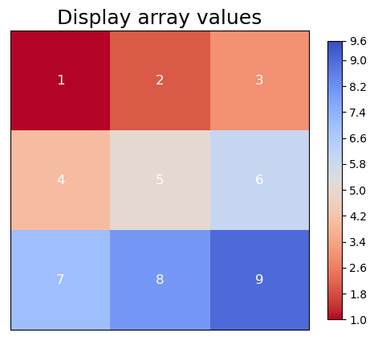
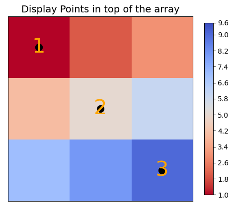

# ArrayGlyph Class

The `ArrayGlyph` class visualizes 2-D and 3-D `numpy` arrays: static plots with
colorbars, cell-value labels and point overlays, faceted grids of subplots, and
animations exported to GIF / MP4 / MOV / AVI.

## Class Documentation

::: cleopatra.array_glyph.ArrayGlyph
    options:
      show_root_heading: true
      show_source: true
      heading_level: 3

## FacetGrid

`ArrayGlyph.facet(...)` returns a `FacetGrid` result object (it mirrors xarray's
`FacetGrid`): a shared `fig`, a 2-D `ndarray` of `axes`, the shared `cbar`, and
`name_dicts` (one `{dim: value}` per panel).

::: cleopatra.array_glyph.FacetGrid
    options:
      show_root_heading: true
      show_source: true
      heading_level: 3

## What's new

- **`plot(kind=...)`** — choose the renderer: `"auto"` (default — `pcolormesh` when
  `coords=` was given, otherwise `imshow`), `"imshow"`, `"pcolormesh"`, `"contour"`,
  `"contourf"`.
- **xarray-aligned colour kwargs** (on the constructor and `plot()`): `robust` (clip
  `vmin`/`vmax` to the 2nd/98th percentile), `center` (symmetrise around a value, auto
  `RdBu_r`), `levels` (discrete colour bins / contour edges), `extend` (colorbar arrows),
  `cbar_kwargs` (forwarded to `fig.colorbar`).
- **`ArrayGlyph(..., coords=(x, y))`** — plot curvilinear / non-uniform grids (1-D cell
  centres or 2-D meshgrids); with `kind="auto"` this routes to `pcolormesh`. Mutually
  exclusive with `extent`.
- **`ArrayGlyph.facet(col=, row=, col_wrap=, col_coords=, row_coords=, kind=, figsize=,
  extents=)`** — a grid of subplots from a 3-D `(N, H, W)` or 4-D `(N, M, H, W)` stack
  with one shared colour scale and colorbar.
- **`animate(..., data_getter=callable)`** — supply each frame lazily (e.g. a NetCDF time
  slab) instead of holding the whole stack in memory.
- `color_scale` is validated against `cleopatra.styles.ColorScale` (also re-exported as
  `cleopatra.array_glyph.ColorScale`); a bad value raises `ValueError`.

!!! note "Changes from earlier versions"
    - `ArrayGlyph.plot()` returns `(fig, ax)`.
    - The cell-value count is exposed as `num_domain_cells` (`no_elem` still works as a
      deprecated alias).
    - `ArrayGlyph(arr)` on an all-NaN / fully-masked array raises `ValueError` instead of
      producing an unusable colour range.

## Examples

### Basic array plot

```python
import numpy as np
from cleopatra.array_glyph import ArrayGlyph

array = np.random.default_rng(0).random((10, 10))
glyph = ArrayGlyph(array)
fig, ax = glyph.plot()
```


### Display cell values

```python
fig, ax = glyph.plot(display_cell_value=True)
```



### Display points

```python
# [value, row, col] per point
points = np.array([[1, 2, 3], [2, 5, 7], [3, 8, 1]])
fig, ax = glyph.plot(points=points)
```



### Render kinds and xarray-style colour kwargs

```python
import numpy as np
from cleopatra.array_glyph import ArrayGlyph

data = np.linspace(-3.0, 8.0, 25).reshape(5, 5)

# filled contours, discretised into 6 levels, colorbar arrows on both ends
fig, ax = ArrayGlyph(data).plot(kind="contourf", levels=6, extend="both")

# centre a diverging colormap on 0 (auto RdBu_r), clip outliers (robust)
fig, ax = ArrayGlyph(data).plot(center=0.0, robust=True)
```

### Curvilinear coordinates (pcolormesh)

```python
import numpy as np
from cleopatra.array_glyph import ArrayGlyph

arr = np.arange(12, dtype=float).reshape(3, 4)
x = np.linspace(0.0, 10.0, 4)   # 1-D cell centres (cols)
y = np.linspace(0.0, 5.0, 3)    # 1-D cell centres (rows)
fig, ax = ArrayGlyph(arr, coords=(x, y)).plot(kind="auto")  # -> pcolormesh
```

### Faceting a stack

```python
import numpy as np
from cleopatra.array_glyph import ArrayGlyph

stack = np.random.default_rng(0).random((6, 20, 20))
g = ArrayGlyph(stack).facet(col="time", col_wrap=3, robust=True)
g.fig.savefig("facet.png")     # g.axes is a (2, 3) ndarray of Axes; g.cbar is shared
```

### Animation

```python
import numpy as np
from cleopatra.array_glyph import ArrayGlyph

time_series = np.stack([np.random.default_rng(i).random((10, 10)) for i in range(5)])
time_labels = ["t1", "t2", "t3", "t4", "t5"]

glyph = ArrayGlyph(time_series)
anim = glyph.animate(time=time_labels)
glyph.save_animation("animation.gif", fps=2)

# lazy frames: only frame i is materialised, on demand
template = np.empty((10, 10))                       # shape template only
glyph = ArrayGlyph(template)
glyph.animate(time=time_labels, data_getter=lambda i: time_series[i])
```


