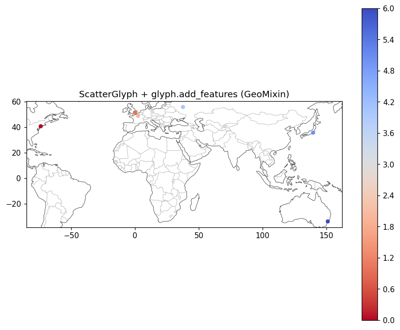

# Geographic basemap methods (glyphs)

The glyphs that plot geographic data — `ArrayGlyph`, `MeshGlyph`, `VectorGlyph`,
`FlowGlyph`, `PolygonGlyph`, and `ScatterGlyph` — inherit
`cleopatra.geo.GeoMixin`, which adds a settable `crs` property plus five
convenience methods that drop a basemap onto the glyph's **own axes** without
importing the standalone helpers:

- `crs` — a validated coordinate-reference-system property (int EPSG code, CRS
  string, or `None`); it defaults the `crs=` of `add_tiles` / `add_features` when
  you omit it, and is validated on assignment.
- `add_tiles` → [`cleopatra.tiles.add_tiles`](tiles.md)
- `add_features` → [`cleopatra.reference.add_features`](reference-data.md)
- `add_relief` → [`cleopatra.reference.add_relief`](reference-data.md)
- `add_reference_map` — a one-call ECMWF/CAMS-style reference-map preset
  (`"ecmwf"`, `"ecmwf-dark"`, or `"auto"`): grey coastlines + borders, a dashed
  lon/lat graticule, °W/°N labels, and a subtle frame.
- `add_labels` → `cleopatra.geo.add_point_labels` (dot + text markers for named
  points, e.g. cities).

Each basemap method is a thin wrapper: it draws on `self.ax` (the axes produced
when you plot the glyph) and forwards its arguments to the matching standalone
function, which remains the single source of truth. Chart and statistical glyphs
(`LineGlyph`, `StatisticalGlyph`, `KDEGlyph`) deliberately do **not** inherit
these geo-only methods.

The module also exposes the standalone `add_point_labels` and `available_map_styles`
functions and the `REFERENCE_MAP_STYLES` preset dict (copy or read it to build a
custom preset).

## Usage

```python
import matplotlib
matplotlib.use("Agg")  # any backend
import numpy as np

from cleopatra.scatter_glyph import ScatterGlyph

# A few cities as (lon, lat) points.
lon = np.array([-74.0, -0.1, 2.35, 13.4, 37.6, 139.7, 151.2])
lat = np.array([40.7, 51.5, 48.9, 52.5, 55.8, 35.7, -33.9])

glyph = ScatterGlyph(lon, lat, values=np.arange(len(lon)))
glyph.plot()                                       # plot your data first

glyph.add_features("coastline", "110m", colors="0.3")   # basemap, on glyph.ax
glyph.add_features("borders", "110m", colors="0.6")
glyph.ax.set_aspect("equal")                       # 1° lon == 1° lat
```



The standalone functions still work for plain matplotlib axes or non-geographic
glyphs:

```python
import matplotlib.pyplot as plt

from cleopatra.reference import add_features

fig, ax = plt.subplots()        # any matplotlib Axes
ax.set_xlim(-180, 180)
ax.set_ylim(-90, 90)
ax.set_aspect("equal")
add_features(ax, "coastline", "110m")
```

!!! note
    Call these **after** plotting (so the glyph has an axes), or pass an explicit
    `ax=`. `add_relief` and `crs=` reprojection require the `cleopatra[tiles]`
    extra; drawing vector layers in EPSG:4326 needs only numpy + matplotlib.

## Module Documentation

::: cleopatra.geo
    options:
      show_root_heading: true
      show_source: true
      heading_level: 3
