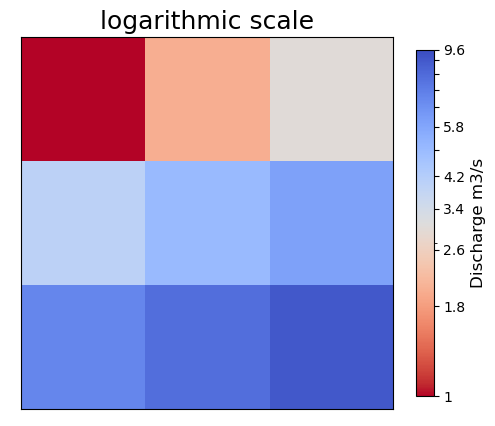
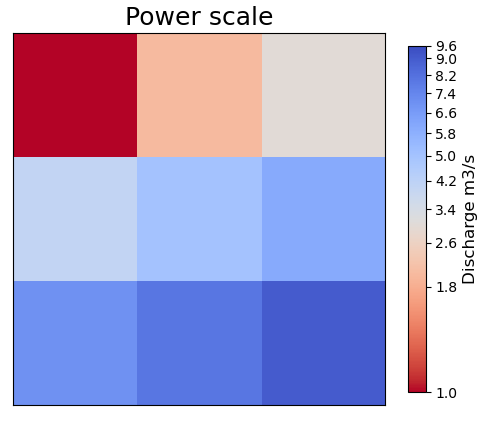
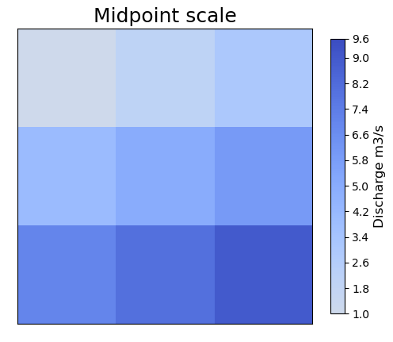

# Styles Module

The `styles` module provides classes and functions for styling plots, including line styles, marker styles, scaling functions, and color normalization.

## Styles Class

::: cleopatra.styles.Styles
    options:
      show_root_heading: true
      show_source: true
      heading_level: 3

## Scale Class

::: cleopatra.styles.Scale
    options:
      show_root_heading: true
      show_source: true
      heading_level: 3

## ColorScale Enum

`ColorScale` is the `StrEnum` of accepted `color_scale` values — `linear` / `power` /
`sym-lognorm` / `boundary-norm` / `midpoint`. Members are real strings (so
`ColorScale.LINEAR == "linear"`) and lookup is case-insensitive. `ArrayGlyph` /
`MeshGlyph` coerce `color_scale` through it, so an unrecognised value (or a non-string
such as an int) raises a clear `ValueError` instead of an obscure `AttributeError`. It is
also re-exported from `cleopatra.array_glyph`.

::: cleopatra.styles.ColorScale
    options:
      show_root_heading: true
      show_source: true
      heading_level: 3

## MidpointNormalize Class

::: cleopatra.styles.MidpointNormalize
    options:
      show_root_heading: true
      show_source: true
      heading_level: 3

## Classification — `classify`

`classify` bins a continuous array into discrete colour classes, returning the
bin edges and a matplotlib `BoundaryNorm`. It is the shared building block behind
classified (categorical) colouring. All schemes are NumPy-native (no extra
dependency): `"quantiles"`, `"equal_interval"`, `"percentiles"`, `"std_mean"`,
and the Jenks-family `"fisher_jenks"` / `"natural_breaks"`. A non-string `scheme`
is treated as explicit, already-chosen bin edges.

::: cleopatra.styles.classify
    options:
      show_root_heading: true
      show_source: true
      heading_level: 3

## Value → size — `resolve_sizes`

`resolve_sizes` maps per-item magnitudes to a visual size range — the reusable
value→size primitive shared by the size-encoding glyphs (`ScatterGlyph` marker
areas, `FlowGlyph` line widths).

::: cleopatra.styles.resolve_sizes
    options:
      show_root_heading: true
      show_source: true
      heading_level: 3

## Legend builders

Reusable, glyph-independent legend helpers that attach a legend to any `Axes`:

- `disjoint_legend` — a categorical (disjoint) swatch legend.
- `swatch_legend` — a compact colour-swatch legend for named layers (used by the
  `colors.apply_data_style` "haze" presets).
- `size_legend` — a legend whose marker *sizes* encode magnitude.
- `width_legend` — a legend whose line *widths* encode magnitude.
- `colorbar_legend` — attach a colorbar for a `ScalarMappable`.
- `histogram_legend` — a colour-mapped histogram drawn as a compact legend.

::: cleopatra.styles.disjoint_legend
    options:
      show_root_heading: true
      show_source: true
      heading_level: 3

::: cleopatra.styles.swatch_legend
    options:
      show_root_heading: true
      show_source: true
      heading_level: 3

::: cleopatra.styles.size_legend
    options:
      show_root_heading: true
      show_source: true
      heading_level: 3

::: cleopatra.styles.width_legend
    options:
      show_root_heading: true
      show_source: true
      heading_level: 3

::: cleopatra.styles.colorbar_legend
    options:
      show_root_heading: true
      show_source: true
      heading_level: 3

::: cleopatra.styles.histogram_legend
    options:
      show_root_heading: true
      show_source: true
      heading_level: 3

## Chrome-free canvas — `apply_blank_canvas`

`apply_blank_canvas` strips an axes down to just the data — no ticks, spines, or
frame — and sets the axes' and figure's background colour. It is the minimal look
the ECMWF/CAMS-style globe animations use (plotted field on black), and composes
with a flat axes, an orthographic globe (`projection.apply_projection_frame`), or
any other cleopatra styling.

::: cleopatra.styles.apply_blank_canvas
    options:
      show_root_heading: true
      show_source: true
      heading_level: 3

## Examples

### Log Scale

```python
import numpy as np
import matplotlib.pyplot as plt
from cleopatra.styles import Scale

# Create some data with a wide range of values
data = np.array([0.1, 1, 10, 100, 1000])

# Apply log scale
scale = Scale()
log_data = scale.log_scale(data)

# Plot the original and log-scaled data
fig, (ax1, ax2) = plt.subplots(1, 2, figsize=(10, 4))
ax1.plot(data)
ax1.set_title('Original Data')
ax2.plot(log_data)
ax2.set_title('Log-Scaled Data')
plt.tight_layout()
```



### Power Scale

```python
# Apply power scale with gamma=0.5 (square root)
power_data = scale.power_scale(data)(0.5)

# Plot the original and power-scaled data
fig, (ax1, ax2) = plt.subplots(1, 2, figsize=(10, 4))
ax1.plot(data)
ax1.set_title('Original Data')
ax2.plot(power_data)
ax2.set_title('Power-Scaled Data (gamma=0.5)')
plt.tight_layout()
```



### Midpoint Normalize

```python
import numpy as np
import matplotlib.pyplot as plt
from cleopatra.styles import MidpointNormalize
import matplotlib.colors as colors

# Create some data with positive and negative values
data = np.random.uniform(-10, 10, (10, 10))

# Create a figure with two subplots
fig, (ax1, ax2) = plt.subplots(1, 2, figsize=(10, 4))

# Plot with standard normalization
im1 = ax1.imshow(data, cmap='RdBu_r', norm=colors.Normalize(vmin=-10, vmax=10))
ax1.set_title('Standard Normalization')
plt.colorbar(im1, ax=ax1)

# Plot with midpoint normalization (midpoint at 0)
im2 = ax2.imshow(data, cmap='RdBu_r', norm=MidpointNormalize(vmin=-10, vmax=10, midpoint=0))
ax2.set_title('Midpoint Normalization')
plt.colorbar(im2, ax=ax2)

plt.tight_layout()
```


